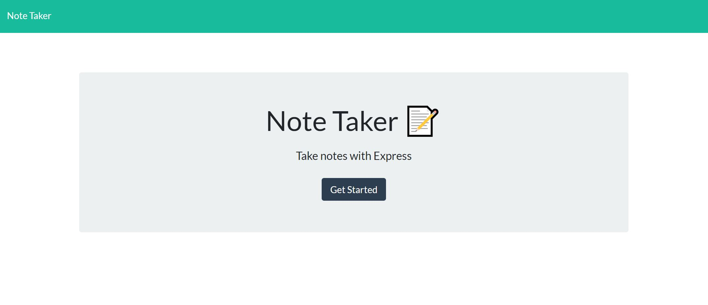

# TakingNotes using Express.js

## Info

```

AS A small business owner
I WANT to be able to write and save notes
SO THAT I can organize my thoughts and keep track of tasks I need to complete

```


 - [For a full web description of the TakingNotes](...)
 - [For a full github description of the TakingNotes](https://github.com/Bonda3Vaax/TakingNotes)

# Features

```
GIVEN a note-taking application
WHEN I open the Note Taker
THEN I am presented with a landing page with a link to a notes page
WHEN I click on the link to the notes page
THEN I am presented with a page with existing notes listed in the left-hand column, plus empty fields to enter a new note title and the note’s text in the right-hand column
WHEN I enter a new note title and the note’s text
THEN a Save icon appears in the navigation at the top of the page
WHEN I click on the Save icon
THEN the new note I have entered is saved and appears in the left-hand column with the other existing notes
WHEN I click on an existing note in the list in the left-hand column
THEN that note appears in the right-hand column
WHEN I click on the Write icon in the navigation at the top of the page
THEN I am presented with empty fields to enter a new note title and the note’s text in the right-hand column
Mock-Up
```

## Mock-Up

The following image shows the web application's appearance and functionality:


(video to follow)

## Requirements 

This project requires:

  - Visual Studio Code
  
  - Chrome Browser

  - Node.js

  - Express.js

  - Heroku

## Installation

TakingNotes requires Visual Studio Code , Node.js, Express.js, Heroku and Chrome Browser in this case, to be installed.   

- [Visual Studio Code](https://code.visualstudio.com/Download)

- [Chrome](https://https://www.google.com.au/chrome/?brand=YTUH&gclid=Cj0KCQjwspKUBhCvARIsAB2IYut5nZcv5KdxSPEM-jChArgYIusCGWIY69hokwFpE1uWWRiR1NGNl4gaAmrbEALw_wcB&gclsrc=aw.ds)
 
- [Node.js](https://nodejs.org/en/download/)

- [Express.js](https://expressjs.com/en/starter/installing.html)

- [Heroku](https://www.heroku.com/)

## How to use

 - Open Visual Studio, click Explorer, add folder to workspace for code inspection, additional modifications, debugging, and visualization in default browser.
 

## Project Status

To be reviewed by the Centralised Grading Team. 

## Author

 - Andrei Bondaret

## Credits

 - [Mdn Web Docs](https://developer.mozilla.org/en-US/)

## Acknowledgements

 - [Visual Studio Code](https://code.visualstudio.com/)
 - [Chrome](https://google.com)
 - [Node.js](https://nodejs.org/en/)
 - [Express.js](https://expressjs.com/)
 - [Heroku](https://www.heroku.com/)